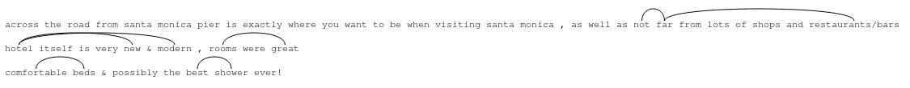
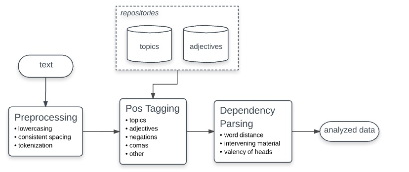

### Introduction

This is my solution for the “Semantic Text Analysis” programming challenge. In this document I will try to cover it’s most important aspects. 

The solution consists of the two main components:

* web application - serving as a GUI for handling user input and presenting analysis results
* the text analysis engine - which performs the actual semantic text analysis

### Installation and setup (linux):

* Make sure that no other service runs on http://127.0.0.1:8000

* Cd into project’s folder and run:
```
./run.sh
```

* Open web browser and enter the following address:
```
http://127.0.0.1:8000/app_dev.php/reviews
```
* Csv files with sample data are available in 'sample_csv' folder. Please note that topics and adjectives have unique constraint defined - adding topics / adjectives that are already defined will result in exception.

##### Troubleshooting:
* *PDOException: could not find driver* - make sure you have pdo drivers for sqlite installed on your system as they are not a part of the composer. To install them run:
```
sudo apt-get install php5.6-sqlite3
```

## Web application

The web application was implemented using Symfony 2.8 and PHP 5.6. using the following features:

* controllers
* services
* routing
* forms
* twig
* custom validators
* entities
* repositories
* doctrine mappings:
    * many to one
    * many to many with join table
* phpunit

For the frontend I used:

* jQuery
* jsGrid
* Bootstrap (and Bootstrap’s form themes for Symfony)
* LoadingOverlay by Gaspare Sganga

#### Text analysis visualization
I thought that it would be nice to have some kind of visualization of how the text analysis algorithm is working. I implemented a simple Javascript class that does that. It’s available under a ‘graph’ button next to analyzed text. Here is a sample render:



Words that go together according to the algorithm, are connected with each other by a Bezier curve. Adjectives, without a matching topic are also marked by a small circle above them. 


## Semantic text analysis
Text mining and text analysis are sophisticated topics and I could easily spend a few months researching different concepts and approaches for the given problem. For the purpose of this programming challenge I decided to follow a simplified approach which of course is far from being applicable for commercial / production level solutions, but I hope will be sufficient to give you an insight on my analytical and problem solving skills. Despite some simplifications, the solution is quite robust and meets the requirements presented in the challenge. 

My text analysis engine consists of 2 main modules, which are:

* Pos tagger
* Dependency parser

In the following paragraphs I will briefly describe each of them.

#### Pos tagger
The main purpose of the this module is to determine which part of a speech is represented by a given word in a sentence. 

My pos tagger organizes words into the following groups:

* topics
* adjectives
* negations
* comas *(which technically are not parts of a speech but are important for my semantic analysis algorithm)*
* other

Pos tagger takes text as an input, i.e:
```
“Hotel itself is very new & modern, rooms were great”
```
And outputs list of parts of a speech, i.e:
```
TOPIC OTHER OTHER OTHER ADJECTIVE OTHER ADJECTIVE COMA TOPIC OTHER ADJECTIVE
```

#### Dependency parser
Dependency parser is responsible for resolving dependencies between words in a sentence. It determines if words are related to each other or not. It operates on input provided by the pos tagger. 
The design of the parser was heavily inspired by the Stanford’s dependency parser and uses some of it’s concepts but in a bit simplified form. These concepts include:

* word distance - words that are closest to each other in a sentence are typically also related
* intervening material - words that are crossed over by a certain separators (comas in my case) are less likely to be related
* valency of heads - used to recognize negations, which are typically placed before the negated subject

#### Concept map


## Results
The algorithm handles the following scenarios:

* multiple adjectives and topics in the same sentence
* negations -  both for positive and negative cases. For example sentence: "The room was **not clean**" will result in -1 score, while "The hotel was **not far** from the beach" will result in +1 (far is a negative adjective but it's negated)
* adjectives without a matching topic. For example sentence "Old, not quite clean." will produce score -2 (old - 1, not clean -1).

#### Limitations
There are however some scenarios in which the algorithm may give incorrect results. These include:

* adjectives / topics not predefined by a user will be recognized by a pos tagger as 'other' which may produce incorrect dependencies. This can be fixed by defining more words or supplying pos tagger with a complete english dictionary
* sentences using non-direct negations, for example: "I've seen many great hotels, but this is not one of them." would be classified as positive based on 'great hotel'. Another example: "Room was anything but clean" (clean room, +1)
* sentences with modals, for example: "With a little effort this could be a good hotel" (good hotel, +1)
* positively defined adjectives used in a negative context, for example: "It was a big fail" (big +1) or negatively defined adjectives used in a positive context, i.e. "You are far enough away from traffic and noise" (far -1)
* reviews containing irony / sarcasm

### For my research I used the following resources:
* Official symfony documentation:
http://symfony.com/doc/2.8/index.html
* Official PHP documentation:
http://php.net/
* Stanford's lectures on their Dependency Parser:
https://web.stanford.edu/class/cs124/lec/Dependencies.pdf
http://nlp.stanford.edu/software/stanford-dependencies.shtml
* PHP implementation of Brill’s pos tagging algorithm:
http://phpir.com/part-of-speech-tagging
* Various articles on text-mining, nlp and data science found on the web
